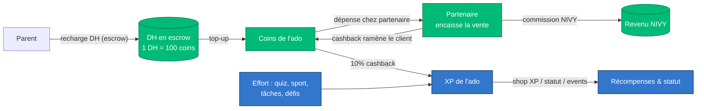

# NIVY — Modèle de Fidélité & White Paper

> **Programme de fidélité & récompenses NIVY.**
> Ce document décrit le modèle économique (« tokenomics » au sens loyauté, **sans
> crypto ni jeton blockchain**) de la plateforme NIVY, et sert de white paper de
> référence pour trois audiences.
>
> **Version :** 1.1 — 2026-07-12 · **Statut :** Draft fondateur (10 incohérences résolues + plafonds F6/F49 livrés)
> **Sources de vérité :** `docs/canon/economy-payments.locked.md`,
> `docs/canon/gamification.locked.md`, `docs/canon/partner-ecosystem.locked.md`,
> `docs/canon/parent-control.locked.md`, `docs/vision/cndp-filing-dossier/*`,
> le code applicatif (`app/`, `gamification-system/`, `features/`), et les
> migrations SQL. En cas de divergence, **le canon verrouillé (`.locked.md`)
> fait foi** ; les `docs/vision/*` sont des snapshots historiques (2026-05-07).

---

## 0. Comment lire ce document

Le white paper se lit à trois niveaux. Chaque section indique son audience
primaire ; les sections « cœur » (le modèle de fidélité §3) sont communes.

| Partie | Audience primaire | Contenu |
|--------|-------------------|---------|
| §1–§2 | **Investisseurs** | Le produit, le marché, la thèse |
| §3 | **Tous** | Le modèle de fidélité — les monnaies, les boucles, les invariants |
| §4 | **Investisseurs** | Unit economics & revenus |
| §5 | **Régulateur / conformité** | Cadre légal, e-money, protection des mineurs, CNDP |
| §6 | **Interne / produit** | Spécification technique, RPC, incohérences à résoudre |
| §7 | **Tous** | Statut d'implémentation honnête (livré / spécifié / en attente) |
| Annexes | Interne | Catalogue, taux, décisions fondateur ouvertes |

### Légende de statut (utilisée partout)

- ✅ **Livré** — présent et câblé dans le code / la base.
- 📋 **Spécifié** — verrouillé au canon mais pas (entièrement) câblé.
- ⏳ **En attente** — dépend d'une décision fondateur ou d'un jalon non construit.
- ⚠️ **Incohérence** — contradiction code↔canon↔marketing à trancher avant publication.

> **Principe directeur (repris du cahier des charges).** NIVY s'interdit tout
> « contenu mock/fabriqué en prod ». Ce white paper applique la même règle : chaque
> chiffre est soit tiré du code/canon (cité), soit marqué comme **placeholder** ou
> **recommandation non implémentée**. Aucune donnée de marché n'est inventée.

---

## 1. Résumé exécutif *(investisseurs)*

**NIVY est le système d'exploitation lifestyle des ados marocains (13–17 ans) et
de leurs parents.** La plateforme lie un **triangle** — ado / parent / partenaire —
autour d'une mécanique de fidélité à deux monnaies non convertibles :

- **XP** — gagné par l'**effort** (quiz, sport, défis, tâches, notes,
  anniversaires). Débloque statut, skins, événements. **Ne devient jamais de
  l'argent.**
- **Coins** — monnaie de **dépense** prépayée, rechargée par les parents en
  dirhams (DH) tenus en **escrow**, dépensée uniquement chez les partenaires
  (sorties, food, transport, marketplace, mentorat).

La **seule passerelle** entre les deux est une **boucle de cashback** : chaque
coin dépensé rapporte de l'XP (10 % par défaut). C'est le moteur de rétention.

**La promesse par côté du triangle** (copie produit live) :

- **Ado** — *« Ton argent, tes sorties, ton crew. Sans quémander. »*
- **Parent** — *« Son autonomie. Votre contrôle. »*
- **Partenaire** — *« Une clientèle ado fidèle. Qu'on vous amène. »*

**Le modèle de revenus** ne prélève **aucun spread** sur la recharge parentale
(1 DH = 100 coins, remboursable à l'inverse exact). NIVY gagne sur : la
**commission partenaire par vente**, l'**abonnement famille** (Free/Silver/Gold/
Platinum), et la **commission marketplace**. Cf. §4.

**Différenciateur défendable :** le triangle de confiance avec conformité
marocaine native (e-signature parentale, Loi 09-08/CNDP, escrow BAM) — *« aucun
concurrent local ne l'a »* — plus le coach IA propriétaire, les actions de groupe
avec paiement fractionné, et le pont online↔offline (QR en boutique + cashback XP).

**Statut :** pré-lancement, beta Casablanca & Rabat. Le socle produit est
largement livré (double wallet, dépense atomique, 8 services lifestyle, crews,
onboarding parent+ado). Le lancement DH réel est **gelé** en attente d'un
partenariat e-money licencié (cf. §5, §7). **Aucun chiffre d'utilisateurs ou de
marché n'est publié** — volontairement.

---

## 2. Le produit *(investisseurs)*

### 2.1 Positionnement

Plateforme lifestyle + gamification pour ados marocains 13–17 ans et leurs
parents. Le cœur : transformer l'argent de poche en une expérience où l'ado gagne
de l'autonomie **par l'effort** et le parent garde le **contrôle** — sans être
« le DAB ».

### 2.2 Le triangle et ses personas

| Côté | Persona type | Besoin central | Ce qu'il obtient |
|------|--------------|----------------|------------------|
| **Ado** | Amine, 15 ans, Niv. 7 · Yasmine, 13 ans | Autonomie + appartenance (crew/quartier) | Gagne XP (effort) + cashback, dépense ses coins, appartient à un crew |
| **Parent** | Khadija | **Confiance** (dépenses + transport) | Recharge en DH, fixe les règles, valide ou laisse faire, historique tracé, géoloc sorties, remboursable 30 j |
| **Partenaire** | Retail / Lieux / Club / Éducation | Clientèle ado fidèle | Vend des offres, héberge des événements, certifie l'XP ; le cashback ramène les clients |

La boucle : **Parent finance → Ado gagne (effort) + dépense (coins) → la dépense
rapporte du cashback XP → Partenaire encaisse la vente + un client qui revient.**

### 2.3 Les verticales de services

**Cœur d'engagement (mature) :** Quiz adaptatif + coach IA, Quêtes
(daily/weekly/monthly/seasonal), Défis physiques, Graphe social (amis / circles /
crews compétitifs / feed / battles / leaderboards).

**Surfaces lifestyle (8 services câblés backend+UI) :** Transport (rides
parent-de-confiance, géoloc, groupe/split, couvre-feu 22h–5h), Food (restaurants
partenaires, halal par défaut), Marketplace C2C (escrow, safe-meet, plafonds
AML), Mentorat + carrière (mentors KYC, approbation parentale), Événements
(objet social central : billet QR, scan, XP post-event), Anniversaires (+500 XP,
packs venue), Allocation + épargne (auto top-up + objectifs avec match parental),
Tâches maison (récompense DH + XP).

> Détail du statut par service en §7. Certaines briques (login chauffeur, funnel
> restaurant public, `resolve_dispute` marketplace) restent à construire.

### 2.4 Le coach IA

Un compagnon (« panda à 5 humeurs ») qui accueille, suggère le quiz/défi du jour,
célèbre les level-ups, aide quand l'ado bloque. Coach unifié basé Claude (livré V4).

> ✅ **Nom tranché (#356, 2026-07-12) : « Niv ».** Le coach parent séparé reste
> **« Aura »**. Canon (`INDEX.locked.md`, `personalization-ai.locked.md`) + code
> (`AgentSheet`, `AgentFloatingButton`, `roles.ts`) alignés ; F54 résolu.

---

## 3. Le modèle de fidélité (« tokenomics ») *(cœur — tous)*

C'est le centre de gravité du document. NIVY n'émet **pas** de jeton
cryptographique (interdiction marocaine — cf. §5.1). Le « token model » est un
**système de fidélité fermé** à unités internes, adossé à de la monnaie réelle en
escrow.

### 3.1 Les unités

NIVY a **exactement trois** constructions monétaires **cloisonnées**, plus une
brique de points de fidélité liée à la carte payante.

| # | Unité | Type | Table source | Détenteur | Convertible ? | Statut |
|---|-------|------|--------------|-----------|---------------|--------|
| 1 | **XP** | Score d'engagement | `user_xp.total_xp` | Ado | ❌ Jamais en cash. Équivalent DH **affichage seul** (1 XP ≈ 0,10 DH) | ✅ |
| 2 | **Coins** | Proxy e-money prépayé | `user_coins.balance` | Ado (escrow parent) | ❌ Jamais ↔ XP. Remboursable au parent à taux fixe | 📋 (câblage partiel) |
| 3 | **DH** | Cash réel (MAD) | `payment_transactions` + `escrow_ledger` | Parent (escrow pour l'ado) | ➡️ DH → coins au top-up (1 sens). Remboursement inverse | ⏳ (rail réel gelé) |
| 4 | **Points fidélité** | Points carte VIP payante | `user_points.total_points` | Ado abonné | Barème d'échange | ⏳ Boucle reportée (gain + échange non câblés) — théâtre UI **retiré** (#355) |

**Règle fondatrice :** la conversion **XP ↔ coins est INTERDITE** — aucune
fonction, RPC, route API ou UI ne peut convertir l'une en l'autre. C'est un
invariant de conformité (protection mineurs), pas seulement un choix de design.

### 3.2 Faucets (sources) et Sinks (puits)

Le principe « tokenomics » : pour chaque unité, on liste ce qui la **crée**
(faucet) et ce qui la **détruit / immobilise** (sink). L'équilibre faucet↔sink
gouverne l'inflation.

#### XP — faucets *(tous chiffres tirés du code/migrations)*

| Source | Montant XP | Anti-abus | Statut |
|--------|-----------|-----------|--------|
| Quiz (réussite) | base **50** (×1,25 si ≥80 %, ×1,5 si ≥90 %) | Crédité **1 seule fois** par (ado, quiz) | ✅ |
| Login quotidien | **10** | Idempotent / jour calendaire | ✅ |
| Défi quotidien / tous défis du jour | **25 / 50** | — | 📋 |
| Missions hebdo | **100–200** | — | 📋 |
| Missions mensuelles | **300–600** | — | 📋 |
| Missions saisonnières | **300–1 500** (Ramadan 1 500) | Fenêtre de validité (réactualisées 2026+, #357) | 📋 |
| Roue de la fortune | **50 / 100 / 200 / 500** (jackpot) + multiplicateurs ×2/×3 | 1 spin gratuit / jour | ✅ |
| Engagement créateur | like **+1** · commentaire **+2** · partage **+5** | Plafonds/jour : **50 / 30 / 20** | 📋 |
| XP octroyé par partenaire | variable | Plafond **500 XP / ado / semaine / émetteur** | 📋 |
| Tâches maison (chores) | **1–500** (défini par le parent) | Payé à la vérification parentale | ✅ |
| Anniversaire | **+500** | 1×/an | 📋 |
| Défi entre amis | pot = 2 × mise (winner takes all) | Mise remboursée si expiré | 📋 |
| **Cashback sur dépense de coins** | **10 %** des coins dépensés (voir §3.3) | Réversible au remboursement | ✅ |

#### XP — sinks

Un **seul** rail de dépense : le **shop de récompenses** (`purchase_reward`),
XP-only, catalogue de **26 articles** verrouillés par `min_level`. Extrait :

| Article | Coût XP | Niveau min |
|---------|--------:|-----------:|
| −20 % entrée | 1 000 | 1 |
| Skip Queue | 2 000 | 3 |
| Entrée Gratuite | 5 000 | 5 |
| T-Shirt | 7 000 | 10 |
| Pass VIP Event | 12 000 | 15 |
| Table Réservée | 15 000 | 25 |
| Meet & Greet Artiste | 25 000 | 30 (VIP only) |

> L'XP est aussi utilisable comme **remise DH** au checkout hybride d'un événement
> (`/api/payments/hybrid`) : c'est une **mécanique de remise**, pas une conversion
> de monnaie — le débit XP et la jambe cash DH sont comptabilisés séparément.

#### Coins — faucets & sinks

- **Faucets :** top-up parental (**1 DH = 100 coins**), payout de tâche, versement
  d'allocation, produit de vente marketplace, match parental sur objectif d'épargne.
- **Sinks :** marketplace C2C, commandes food, rides, sessions de mentorat, offres
  partenaires. **Jamais** le shop XP. Immobilisation : coins verrouillés sur un
  objectif d'épargne (non dépensables tant que l'objectif n'est pas atteint).
- **Remboursement :** **1 coin = 0,01 DH** (inverse exact du top-up), **au parent
  financeur uniquement**, sur le rail PSP d'origine, sous 14 jours. Le cash-out
  direct de l'ado est **INTERDIT** (mineurs — cf. §5.3).

#### DH — faucets & sinks

- **Faucet :** recharge parentale via PSP (CMI, Cash Plus/Wafacash/M2T, Mobile
  Money, Stripe international, ou cash via ambassadeur).
- **Sink :** conversion en coins au top-up (append-only escrow), remboursement au
  parent, règlement B2B des partenaires/chauffeurs/mentors (rail comptable séparé).

### 3.3 La boucle unique — le moteur de cashback

**Lecture :** deux circuits parallèles qui ne se mélangent jamais. Le circuit
**monétaire** (DH → coins → partenaire → commission) et le circuit **effort/statut**
(effort → XP → récompenses). Le **cashback 10 %** est le **seul pont** : il
transforme une dépense en progression, ce qui pousse à dépenser chez les
partenaires NIVY plutôt qu'ailleurs (rétention + effet réseau partenaire).

### 3.4 Invariants du modèle (règles de conservation)

Ce sont les lois « physiques » du système. Toute PR qui les viole est bloquée en
revue.

1. **Non-convertibilité XP ↔ coins** — aucun chemin, jamais. *(Zéro chemin
   aujourd'hui — à préserver.)*
2. **Traçabilité coins** — tout mouvement de coins insère une ligne appairée
   `coin_transactions` **et** `escrow_ledger` (adossement prouvable).
3. **Cashback obligatoire** — toute dépense de coins crédite du cashback XP ; tout
   remboursement le **reverse**.
4. **Escrow append-only** — `escrow_ledger` ne connaît ni UPDATE ni DELETE.
5. **Identité canonique** — `auth.users.id` ; les RPC monétaires prennent des UUID typés.
6. **Pas de flottants** — `amount_dh numeric(10,2)`, `amount_coins integer`,
   `amount_xp integer`.
7. **Écritures monétaires via RPC SECURITY DEFINER uniquement** — jamais
   d'INSERT/UPDATE direct depuis le client ou une route API.

### 3.5 Paliers & multiplicateurs

Le modèle superpose **plusieurs échelles** distinctes — à ne pas confondre.

**(a) Échelle VIP par XP — 7 paliers** (statut gamifié, gratuit, gagné par XP) ✅

| Palier | XP cumulé requis |
|--------|-----------------:|
| Standard | 0 |
| Bronze | 1 000 |
| Silver (Argent) | 5 000 |
| Gold (Or) | 15 000 |
| Platinum (Platine) | 35 000 |
| Diamond (Diamant) | 75 000 |
| Legendary (Légendaire) | 150 000 |

Chaque palier porte des bonus (`xp_multiplier`, `coin_multiplier`,
`drop_rate_bonus`, spins/jour, early-access, remise…), pilotés en base.

**(b) Carte VIP payante** (abonnement **annuel** Stripe, distinct de l'échelle XP) ✅ paiement

| Carte | Prix | Points gagnés | Remise partenaires |
|-------|------|---------------|--------------------|
| Silver | Gratuit | 1 pt / 10 DH | −10 % |
| Gold | 299 DH | 2 pts / 10 DH | −10 % (+ events −20 %, clubs −15 %) |
| Platinum | 599 DH | 3 pts / 10 DH | −20 % (+ events −30 %, clubs −25 %) |

> ✅ **Cadence tranchée (#354) : annuelle** — 299/599 DH **/an** (`duration_months: 12`) ;
> UI de souscription, description Stripe et calcul d'économies alignés.
> ⏳ **Points fidélité : boucle reportée.** Le gain (`award_loyalty_points`) et
> l'échange ne sont pas câblés ; le **théâtre UI a été retiré (#355)** et la page
> `carte-vip/recompenses` redirige vers la vraie valeur (réduction VIP automatique +
> boutique XP). Câbler la boucle de points reste un jalon produit.

**(c) Multiplicateurs transactionnels** — silver/gold/platinum appliquent ×1/×2/×3
sur l'XP transactionnel lors d'une remise partenaire.

### 3.6 Contrôles anti-inflation / anti-abus

| Contrôle | Valeur | Statut |
|----------|--------|--------|
| Quiz : crédit unique par quiz | 1 award / (ado, quiz) | ✅ |
| Créateur : plafonds journaliers | 50 / 30 / 20 XP (like/comment/share) | 📋 |
| Partenaire : plafond XP | 500 XP / ado / semaine / émetteur | 📋 |
| Seuil approbation parentale (paiement XP) | ≥ 1 000 XP (≈ 100 DH) | ✅ |
| Plafond top-up mensuel / parent | **500 DH** (overridable post-KYC via `parental_limits`) | ✅ migration 179 (`top_up_teen`) |
| Plafond agrégé mensuel / ado | **5 000 DH** (tous parents confondus) | ✅ migration 179 (`top_up_teen`) |
| Plafond top-up unitaire | **200 DH** (aligné BAM lightly-KYC) | ✅ route + packs 50–200 DH (#351) + RPC (mig 179) |
| Plafond mensuel de dépense / ado | configuré par le parent (`max_monthly_spend_dh`) | ✅ migration 179 (`_debit_teen_coins`, rails V6) |
| Plafond AML marketplace | 1 000 DH / ado / mois | ⏳ décision fondateur |

> ✅ **Plafonds câblés (migration 179, 2026-07-12).** La table `parental_limits`
> existe ; `_check_topup_caps` est appliqué dans les **deux surcharges** de
> `top_up_teen`, et le plafond mensuel de dépense dans `_debit_teen_coins` (rails V6).
> Défauts BAM seedés (200 / 500 / 5 000 DH), overrides en `service_role` uniquement
> (relèvement = post-KYC). Reste ouvert : plafond AML marketplace + whitelist par
> catégorie (F49, cf. Annexe B).

### 3.7 Courbe de niveaux

Niveaux **1 à 100**. ✅ **Courbe unifiée (#348)** — l'UI dérive désormais de la
formule backend qui fait foi pour `user_xp.current_level` :

- XP cumulé pour être niveau N = **50 · N · (N−1)** (= (N−1)·N/2 × 100) → L2=100,
  L3=300, L4=600, L5=1 000, L6=1 500…
- XP pour passer du niveau L au L+1 = **100 · L**.

`lib/gamification/level-curve.ts` réécrite + test `tests/unit/level-curve.test.ts`
(5/5) vérifiant que le niveau affiché == le niveau calculé en base, sur un large
éventail d'XP.

---

## 4. Unit economics & business model *(investisseurs)*

### 4.1 Principe : NIVY ne prend pas de spread sur l'argent des familles

Le top-up est **1 DH = 100 coins sans marge**, remboursable à l'inverse exact
(1 coin = 0,01 DH). NIVY n'est **pas** un « float play » sur l'argent de poche :
la confiance parentale est le produit. Le revenu vient d'ailleurs.

### 4.2 Flux de revenus

| # | Flux | Structure | Statut |
|---|------|-----------|--------|
| 1 | **Commission partenaire** *(primaire)* | Par vente, **jamais d'abonnement**. Grille par catégorie **live** : Retail **8 %** · Lieux **10 %** · Clubs **12 %** · Éducation **15 %** (#352). Payout partenaire sous 7 j | ✅ |
| 2 | **Abonnement famille** | Free **0** · Silver **29** · Gold **79** · Platinum **149** DH/mois. Le gratuit inclut **tout le contrôle parental** ; le payant ajoute confort (enfants, historique, tutorat, concierge WhatsApp) + remise top-up | 📋 rail Stripe séparé, `family_subscriptions` vide |
| 3 | **Carte VIP ado** | Gold 299 / Platinum 599 **DH/an** (#354) | ✅ Stripe |
| 4 | **Commission marketplace** | **8 %** par vente C2C (5 % NIVY + 3 % assurance confiance) | 📋 |
| 5 | **Marge B2B lifestyle** | Food/ride/mentor : la marge implicite entre la valeur faciale des coins et le règlement partenaire (rail A/P séparé) | 📋 non chiffrée |

> **La sécurité n'est jamais une option payante** : tout le contrôle parental est
> gratuit à vie. Les tiers payants vendent du **confort**, pas de la sécurité. C'est
> un choix de positionnement (confiance) autant qu'un argument réglementaire.

### 4.3 ✅ Incohérences de taux — résolues (2026-07-12)

1. **Commission partenaire** — grille par catégorie **8/10/12/15 %** désormais servie
   par `get_partner_commission_pct` (table `partner_commission_rules`, mig 176).
   Vérifié live. (#352)
2. **Ambassadeur — seuil de retrait** — aligné à **500 DH** (route + page + form). (#353)
3. **Ambassadeur — commission** — **10 % par défaut**, majoré par palier
   (bronze 10 / silver 12 / gold 15), conforme au canon.

### 4.4 Le programme ambassadeur (levier de croissance)

Commission (~10 %) sur les achats des filleuls, attribution à vie. **Deux
pistes** : cash (adulte, KYC requis) et **XP-only pour les ados** (< 18 ans, bascule
automatique en cash à la majorité — contrainte légale). Retrait via virement / Cash
Plus / mobile wallet. La boutique de points ambassadeur (`redeem_ambassador_reward`)
est **réellement câblée** (contrairement aux points de la carte VIP).

### 4.5 Exemple de flux économique (illustratif)

> Chiffres illustratifs à taux canon, **pas** une projection.

Un parent recharge **100 DH** → **10 000 coins** en escrow. L'ado dépense **2 000
coins** (20 DH) chez un partenaire retail :

- Partenaire encaisse 20 DH de vente ; **commission NIVY = 8 %** → 1,60 DH.
- Ado reçoit **10 % de cashback en XP** = 200 XP (progression, pas du cash).
- Les 200 XP rapprochent l'ado du prochain palier VIP / d'un article shop → il
  revient. Le cashback **ramène le client chez le partenaire** au prochain achat.

---

## 5. Conformité & cadre réglementaire *(régulateur)*

> ⚠️ **Avertissement :** plusieurs numéros d'articles (Loi 09-08 art. 11/12/21/25/43,
> Loi 43-05, durées de rétention) sont marqués **« à confirmer »** dans le dossier
> CNDP et **n'ont pas été validés par un conseil juridique**. Ne pas les présenter
> comme des citations légales arrêtées sans la revue avocat que les docs eux-mêmes
> réclament.

### 5.1 Cadre légal de référence

| Texte | Ce qu'il contraint |
|-------|--------------------|
| **Loi 09-08** + décret 2-09-165 (protection des données, CNDP) | Traitement des données parent (CIN, tél, email) pour le KYC ; régime de consentement des mineurs |
| **BAM Circular 6/W/2017** (e-money) | Détenir des soldes prépayés parentaux = émission de monnaie électronique → licence EP **ou** partenariat avec un EP licencié ; plafonds sur wallets faiblement KYC |
| **Loi 103-12** (Code bancaire), art. 16 | Statut d'Établissement de Paiement (EP) |
| **Loi 78-12** (statut BAM, services de paiement) | Régulation des services de paiement |
| **Loi 13-10** (jeux de hasard) | Loot boxes à probabilités cachées + narratif de conversion DH pour un public mineur = risque « jeu de hasard » |
| **Loi 43-05** (anti-blanchiment / AML) | Rétention KYC 5 ans après fin de relation |
| **Communiqué BAM/AMMC/Office des Changes 2017-11-20** (interdiction crypto) | Émission crypto illégale → framing « stablecoin » non viable ; **d'où le modèle e-money/escrow prépayé** |
| **Office des Changes** (IGOC 2024) | Contrôle des changes pour parents non-résidents (diaspora) |

**Conséquence directe :** NIVY **n'émet aucun jeton crypto**. Les coins sont un
**solde tracké en base, adossé à du DH en escrow** chez NIVY ou un partenaire
e-money licencié BAM (Cash Plus / Wafacash / M2T). C'est la raison structurelle
pour laquelle ce « token model » est un programme de fidélité, pas une blockchain.

### 5.2 Statut e-money & escrow

- **NIVY n'est PAS l'émetteur e-money de référence.** Posture cible recommandée
  (⏳ non contractée) : **Option B + D** — partenaire avec **un EP licencié BAM**
  (M2T / Cash Plus / Wafacash) comme émetteur de référence (B), et exposer
  CMI + Mobile Money + Stripe + cash-ambassadeur comme **rails de collecte** vers
  le wallet tenu par le partenaire (D). Stripe limité aux **cartes internationales
  non-MAD** (parents diaspora).
- **Condition bloquante :** *le fondateur doit signer un partenariat EP avant tout
  flux DH réel* (décision **F25, OUVERTE**).
- **Au lancement : top-up manuel uniquement.** `PSP_AUTO_TOPUP_ENABLED=false`
  (décision **F5, ACTÉE**) — le parent signale un virement hors-bande → file
  `manual_topup_requests` → l'admin crédite via `top_up_teen`. Cash Plus visé en
  semaine +2.
- **Écart réel :** aucune table d'escrow (`payment_transactions`, `escrow_ledger`,
  `cash_settlements`, `webhook_events`) n'est **live** en base aujourd'hui ; aucun
  KYC parent avant top-up (seule une e-signature). **Aucun rail DH réel n'est en
  production.**

### 5.3 Protection des mineurs

- **Cash-out ado INTERDIT** (verrouillé, réglementaire — BAM 6/W/2017 + Loi 09-08 :
  un mineur ne peut retirer de la monnaie électronique). Remboursement **au seul
  parent financeur**, rail d'origine, sous 14 jours.
- **E-signature parentale + upload CIN** obligatoire avant qu'un compte ado
  existe. C'est un **gate serveur strict (403)** sur top-up, approbations, cascades.
  Onboarding **parent-invité uniquement** au lancement.
- **File d'approbation parentale** par action (rides, mentorat, achats au-dessus
  d'un plafond, food, consentement photo).
- **Garde-fous additionnels (CNDP) :** pas de messagerie directe avec inconnus ;
  couvre-feu transport 22h–5h sans dérogation parentale explicite ; points de
  rencontre marketplace restreints (écoles / lieux partenaires KYC) ; filtre halal
  par défaut ; KYC obligatoire de tout adulte (mentor, chauffeur) avant interaction
  avec un mineur ; pas de publicité comportementale.
- **Plafonds top-up/dépense** ✅ câblés (migration 179 — cf. §3.6) : par opération,
  mensuel parent, agrégat mensuel ado, plafond de dépense configuré par le parent.
  Relèvement d'un plafond = process post-KYC (écritures `parental_limits` en
  service_role uniquement — un parent ne peut pas s'auto-relever).
- **Majorité (18 ans)** — gel du wallet + notification + choix (cash-out au parent
  ou re-KYC en compte adulte), 30 j de grâce. **Aucun code aujourd'hui** (décision
  **F50, OUVERTE**).

### 5.4 Protection des données (CNDP)

- **Régime visé :** autorisation préalable (mineurs + géoloc temps réel +
  profilage + transferts transfrontaliers). **Dossier rédigé, non déposé.**
- **Registre : 13 traitements (T-01…T-13)** — dont paiements/e-money (T-05),
  géoloc transport de mineurs (T-07), photos/vidéos (T-08), KYC partenaire (T-09),
  profilage comportemental (T-12). L'enregistrement de sessions mentor (T-10) est
  **en attente de décision fondateur** et hors dépôt initial.
- **Consentement mineur = e-signature parentale** (CIN, horodatage, IP, UA,
  versions CGU/politique), conservée 5 ans, révocable (verrou + suppression sous
  30 j).
- **Hébergement :** Supabase Francfort (UE) + Vercel UE ; sous-traitants Resend
  (US, SCC à valider), Stripe (IE/US).
- ⏳ **DPO non désigné** (recommandé). ~20 champs `<<TO_FILL>>` restants. Instruction
  CNDP anticipée : 6–12 semaines avant lancement public.
- ⚠️ **Régression P0 identifiée :** les CIN sont aujourd'hui uploadés dans un
  **bucket public** (`getPublicUrl`) — fuite permanente de CIN marocaines,
  **contredit le dossier CNDP**. Bucket privé `parent-cin` + URLs signées ≤ 5 min à
  livrer d'urgence.

### 5.5 KYC

- **Parent** — aujourd'hui seule une e-signature (CIN uploadée mais **pas de
  vérification d'identité active, ni AML**). Les exigences CDD BAM ne sont pas
  remplies ; à hériter du partenaire EP (Option B).
- **Partenaire** (mentors, chauffeurs, marchands) — CIN/RC/ICE/RIB en bucket privé
  `kyc-documents`, rétention 5 ans. RLS `kyc_owner_read` ; ⚠️ politique de lecture
  admin manquante.

### 5.6 Interdictions dures (bloquantes en revue)

| # | Interdiction | Base |
|---|--------------|------|
| A | Cash-out ado | BAM 6/W/2017 + Loi 09-08 |
| B | Conversion XP ↔ coins | Invariant + protection mineurs |
| C | Loot box à RNG cachée (public 13–17 + narratif DH) | Loi 09-08 + Loi 13-10 → **ladder déterministe uniquement** |
| D | Montants DH côté client / mint à la demande | Anti-fraude (le parent pourrait « minter » des coins) |
| E | Écriture directe en table monétaire | RPC SECURITY DEFINER + service_role uniquement |
| F | Transfert de valeur P2P ado↔ado | Contourne l'approbation parentale |
| G | CIN via URL publique | Bucket privé + URL signée ≤ 5 min |
| H | Mouvement de coins sans ligne `escrow_ledger` appairée + cashback | Traçabilité |

> État : 3 lignes `mystery_box` encore actives (à passer `is_active=false` jusqu'à
> revue légale, décision **F51**) ; une action `exchange`/`transfer` legacy encore
> exposée (P0 à retirer).

---

## 6. Spécification interne *(équipe produit)*

### 6.1 RPC canoniques d'écriture monétaire

Toutes SECURITY DEFINER (sauf note), paramètres UUID typés, garde
`auth.uid() = p_caller_id OR auth.uid() IS NULL`, EXECUTE au `service_role`.

| RPC | Rôle | Statut |
|-----|------|--------|
| `top_up_teen` | DH → coins escrow (×100), idempotent | ✅ (ajouter `p_idempotency_key` UNIQUE) |
| `spend_teen_coins` | Débit coins + escrow + cashback XP + partner_transactions | ✅ (doit peupler `related_spend_id`) |
| `add_xp_to_user` | Crédit XP + `xp_transactions` | ✅ |
| `purchase_reward` | Débit XP shop atomique | ✅ (seul rail shop) |
| `payout_chore_reward` / `disburse_allowance` | Délèguent à `top_up_teen` | ✅ (REVOKE PUBLIC/anon sur allowance) |
| `purchase_partner_offer` | Achat offre partenaire aux coins, idempotent, gating VIP | ✅ |
| `apply_partner_offer` | Scan POS partenaire v2, HMAC + nonce anti-replay | ✅ |
| `buy_listing` / `confirm_receipt` / `open_dispute` | Marketplace C2C escrow | 📋 partiel |
| `resolve_dispute` | Résolution litige marketplace | ⏳ **P0 manquant** |
| `refund_top_up` / `refund_teen_coins` / `revoke_xp_cashback` | Chaîne de remboursement | ⏳ **P0 manquant** |
| `complete_mentor_session` / `pay_featured_creator` / `release_savings_goal` | Compléments | ⏳ P1 manquant |
| `_cashback_pct` | Ladder cashback centralisé | ✅ extrait (mig 175) |
| `_check_topup_caps` | Plafonds top-up BAM (op / mensuel parent / agrégat ado) | ✅ (mig 179) |

### 6.2 Cashback — réalité d'implémentation

Le taux se résout : `cashback_rules` (par partenaire) → `xp_payment_settings.
default_cashback_pct` → fallback **10 %**. ✅ **Matérialisé (mig 175)** : la table
`cashback_rules` et le réglage `default_cashback_pct = 10` existent en live, et le
helper canonique `_cashback_pct(partner_id)` (iso-sémantique du ladder inline de
`_debit_teen_coins`) centralise la résolution — vérifié `_cashback_pct(NULL) = 10`.
Des taux par partenaire sont désormais possibles (insérer une ligne `cashback_rules`).

### 6.3 Registre des incohérences — ✅ toutes résolues (2026-07-12)

Les 10 points ci-dessous ont été **implémentés, appliqués en base live et vérifiés**
(mapping issue→migration en Annexe C). Conservé comme registre historique.

| # | Incohérence | Résolution (livrée) |
|---|-------------|---------------------|
| 1 | Deux courbes de niveau (backend vs UI) | Courbe backend retenue, UI dérivée (50·N·(N−1)) + test |
| 2 | XP→DH stocké 3 fois (TS 0,10 ; DB `xp_to_dh_rate=100` mort ; narratif) | **10 XP = 1 DH** (TS fait foi), supprimer la ligne DB morte |
| 3 | Cashback : table `cashback_rules` absente | Créer + seeder `default_cashback_pct` |
| 4 | Packs top-up (`topup/page.tsx`) incohérents avec 1 DH=100 coins | Table `topup_packages` serveur, retirer le tableau TSX |
| 5 | Commission partenaire 8/10/12/15 % (marketing) vs 10 % plat (backend) | Grille par catégorie servie par `get_partner_commission_pct` (mig 176) |
| 6 | Ambassadeur seuil retrait 100 (code) vs 500 (canon) | Aligné à **500 DH** (route + page + form) |
| 7 | Carte VIP prix /an vs /mois vs Stripe 1 mois | Clarifier cadence |
| 8 | Points fidélité carte VIP : gain non implémenté, échange = théâtre | Théâtre **retiré** ; page redirige vers réduction VIP + boutique XP ; boucle reportée |
| 9 | Coach « Niv » (live) vs « Kai » (canon) | Tranché : **Niv** (canon + code alignés) |
| 10 | Seeds missions datés 2025 | Réactualiser les fenêtres |

### 6.4 Tables monétaires canoniques

`user_xp`, `user_coins`, `xp_transactions`, `coin_transactions`, `escrow_ledger`,
`payment_transactions`, `shop_rewards`, `reward_categories`, `shop_purchases`,
`marketplace_listings`, `marketplace_transactions`, `partner_transactions`,
`food_orders`, `ride_bookings`, `parent_allowances`, `allowance_disbursements`,
`savings_goals`, `cashback_rules`, `xp_payment_settings`.

**Livrées depuis (2026-07-12) :** `topup_packages` (mig 177), `parental_limits`
(mig 179), `cashback_rules`/`partner_commission_rules` (migs 175/176).
**À livrer (écrites mais non-live) :** `cash_settlements`, `webhook_events`,
`payment_logs`, `mentor_payouts`.

---

## 7. Statut d'implémentation *(honnête, tous)*

| Brique | Statut |
|--------|--------|
| Shop XP (`purchase_reward`) — seul rail de dépense XP live | ✅ |
| Échelle VIP par XP (7 paliers) | ✅ |
| Carte VIP payante (Stripe checkout + confirm + email) | ✅ |
| Achat offre partenaire aux coins (atomique, idempotent) | ✅ |
| Scanner POS partenaire v2 (HMAC + nonce) | ✅ |
| Cashback XP (fallback 10 %, réversible) | ✅ |
| Ambassadeur : commissions cash + retraits + boutique points | ✅ |
| Top-up manuel (admin) + gate e-signature + `top_up_teen` | ✅ |
| **Points fidélité carte VIP (gain + échange)** | ⏳ boucle reportée — théâtre UI **retiré** (#355) |
| Pipeline coins bout-en-bout | 📋 partiel |
| Top-up PSP auto (Cash Plus, CMI…) | ⏳ gelé (F5), pas d'EP signé (F25) |
| Tables escrow live en base | ⏳ à migrer |
| Plafonds top-up/dépense (BAM) | ✅ complets (mig 179) : 200 DH/op + 500 DH/mois/parent + 5 000 DH/mois/ado + plafond de dépense parental |
| KYC parent au-delà de l'e-signature | ⏳ non implémenté |
| Bucket CIN privé + URLs signées | ⏳ **P0 régression (public aujourd'hui)** |
| Dossier CNDP (13 traitements) | ⏳ rédigé, non déposé, DPO à nommer |
| Gestion wallet à 18 ans | ⏳ décision F50 |
| `resolve_dispute` / refunds coins | ⏳ P0 manquants |

**Ligne de fond :** le **shop XP est le seul rail de dépense pleinement live** ; le
circuit coins/DH est spécifié et partiellement câblé mais **bloqué en production**
tant qu'un partenaire e-money n'est pas signé. Le programme de **points de fidélité
de la carte VIP est le principal écart** entre la promesse marketing et le code.

---

## Annexe A — Récapitulatif des taux (canon)

| Taux | Valeur | Sens |
|------|--------|------|
| Top-up | 1 DH = 100 coins | 1 sens (dépôt) |
| Remboursement coins | 1 coin = 0,01 DH | Au parent uniquement |
| XP → DH (affichage) | 1 XP = 0,10 DH (10 XP = 1 DH) | Affichage / remise seulement |
| Cashback dépense coins | 10 % en XP | Fallback effectif |
| Commission partenaire | 8/10/12/15 % par catégorie (live) | ✅ (#352) |
| Commission marketplace | 8 % (5 % + 3 %) | 📋 |
| Commission ambassadeur | 10 % (→ 12/15 % par palier) | ✅ (#353) |

## Annexe B — Décisions fondateur ouvertes (bloquantes)

- **F5** ✅ acté — top-up manuel uniquement au lancement.
- **F25** ⏳ — signer un partenariat EP e-money (bloque le DH réel).
- **F6** ✅ **RÉSOLU (mig 179, 2026-07-12)** — plafonds top-up 200/op + 500/mois/parent
  + 5 000/mois/ado, enforcés dans `top_up_teen`, overrides `parental_limits` post-KYC.
- **F49** ✅ partiel (mig 179) — plafond mensuel de dépense parental enforcé dans
  `_debit_teen_coins` (rails V6). Restant : whitelist par catégorie (attend une
  catégorie dans le pipeline de dépense) + réécriture des débiteurs directs legacy
  (`buy_listing`, `complete_ride`) déjà flaggés RED au canon §7.
- **F50** ⏳ — gestion du wallet à la majorité.
- **F51** ⏳ — statut des mystery boxes (ladder déterministe).
- **F14** ⏳ — TTL des URLs signées CIN.
- **Nom du coach** ✅ **tranché** — **Niv** (#356, F54 résolu ; Aura = coach parent).
- **Points fidélité carte VIP** ⏳ — théâtre **retiré** (#355) ; câbler la boucle de
  points reste un jalon produit à décider.

## Annexe C — Journal des arbitrages (2026-07-12)

Les 10 incohérences du §6.3 ont été tranchées **conformité d'abord**, puis
implémentées. Statut : **migrations 174–180 (+092) appliquées en base live le
2026-07-12** et vérifiées post-application (commission par catégorie 8/10/12/15
live, packs 50–200 DH, `xp_to_dh_rate` supprimée, `_cashback_pct(NULL)=10`,
plafonds 200/500/5 000 seedés, missions saisonnières réactivées — 0 fenêtre passée).

| Issue | Décision | Implémentation |
|-------|----------|----------------|
| [#348](https://github.com/mikaelduce93/nivy/issues/348) | Courbe UI = courbe backend | `lib/gamification/level-curve.ts` réécrite (100·L / 50·N·(N-1)) + test `tests/unit/level-curve.test.ts` |
| [#349](https://github.com/mikaelduce93/nivy/issues/349) | 10 XP = 1 DH (TS fait foi) | Migration 174 supprime la ligne DB morte |
| [#350](https://github.com/mikaelduce93/nivy/issues/350) | Cashback configurable, défaut 10 % | Migration 175 : table `cashback_rules` + `default_cashback_pct` + helper `_cashback_pct` |
| [#351](https://github.com/mikaelduce93/nivy/issues/351) | Packs 1 DH=100 coins strict, **50–200 DH/op**, **0 bonus** | Migration 177 `topup_packages` (plancher = `min_topup_dh` live) + `lib/payments/topup-packages.ts` + page/route recâblés |
| [#352](https://github.com/mikaelduce93/nivy/issues/352) | Grille commission par catégorie 8/10/12/15 % | Migration 176 : `partner_commission_rules` + `get_partner_commission_pct` réécrite |
| [#353](https://github.com/mikaelduce93/nivy/issues/353) | Seuil retrait ambassadeur **500 DH** | route + page + form alignés |
| [#354](https://github.com/mikaelduce93/nivy/issues/354) | Carte VIP **annuelle** (299/599 /an) | `souscrire` : `duration_months: 12`, labels /an |
| [#355](https://github.com/mikaelduce93/nivy/issues/355) | Retirer le théâtre des points, pointer vers la vraie valeur | `carte-vip/recompenses` réécrite (réduction VIP auto + boutique XP, aperçu « bientôt ») |
| [#356](https://github.com/mikaelduce93/nivy/issues/356) | Coach = **Niv** | AgentSheet/AgentFloatingButton/roles.ts + canon aligné |
| [#357](https://github.com/mikaelduce93/nivy/issues/357) | Missions saisonnières décalées vers le futur | Migration 178 (décalage annuel idempotent) |
| F6 / F49 | Plafonds monétaires complets (BAM + contrôle parental) | Migration 179 : `parental_limits` + `_check_topup_caps` dans les 2 overloads `top_up_teen` + plafond de dépense dans `_debit_teen_coins` ; smoke-test transactionnel 6/6 (rollback, zéro résidu) |

> **Deux garde-fous conformité ajoutés au passage :** plafond top-up ramené de
> 500 → **200 DH/opération** (BAM lightly-KYC) et **suppression des bonus coins**
> (un coin non adossé à du DH violerait l'invariant d'escrow).

---

*Fin du white paper. Toute modification d'un taux, d'une conversion, d'un
invariant ou d'un statut de conformité requiert l'accord fondateur et une mise à
jour concomitante du canon (`docs/canon/economy-payments.locked.md`) et de
`lib/payments/xp-converter.ts`.*
